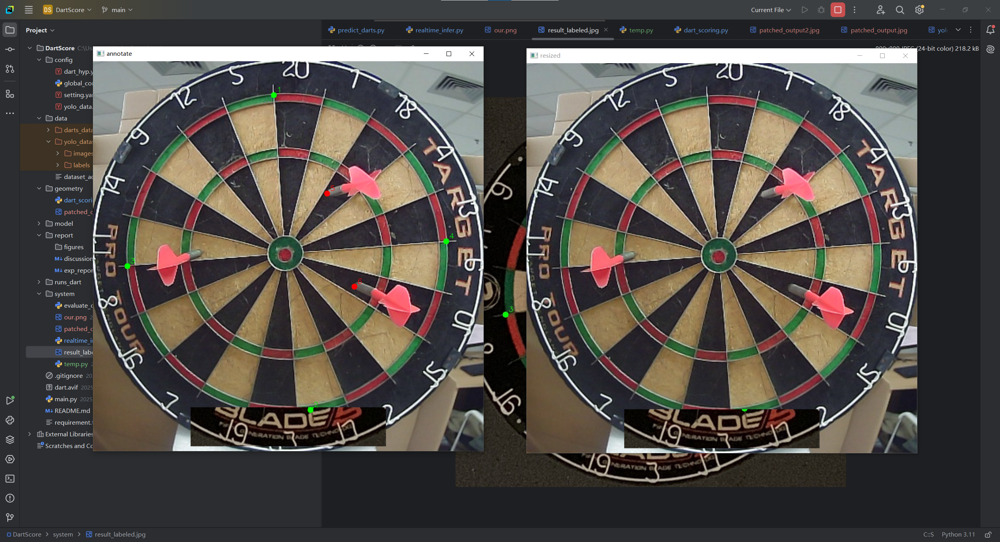
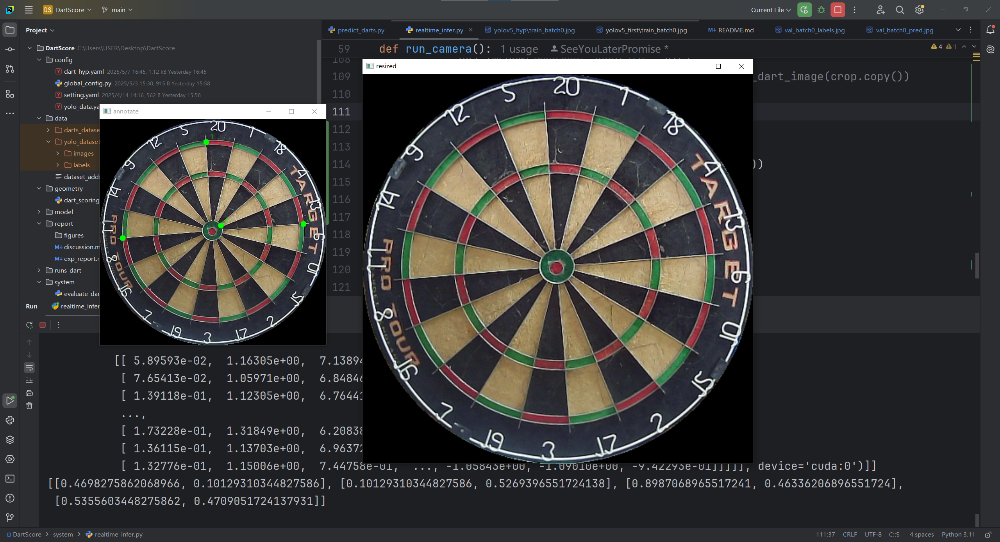
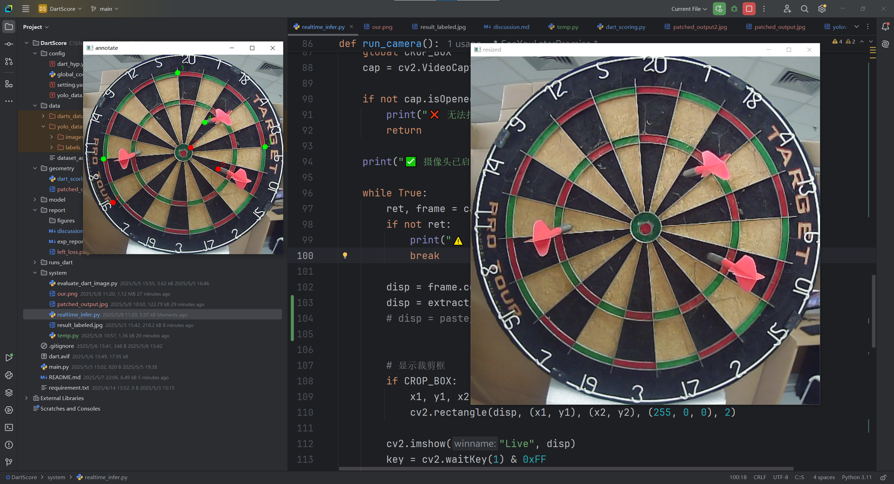

## 预测出来的点顺序不一样要紧吗

飞镖坐标顺序不固定是正常的，YOLO 检测出的多个飞镖顺序可能随模型内部处理顺序略有差异；

只要每个飞镖的位置坐标是准确的，并不会影响打分；

打分函数只看坐标，不关心先后顺序。

## 2025.0508

- 进展：在`贴图`的辅助下可以正确预测四个参考点，但左边的飞镖点预测不出来。
  

- 发现：

  - 考虑过是环境的干扰，尝试过`mask`，但效果不好。
    
  - 若四个参考点都预测不全，会间接干扰飞镖点的预测。
    

- 挑战：

1. 流式处理 （可选）
2. 贴图的解决方案不美:
   - 自己拍摄收集数据再微调（太繁琐，最后考虑）
   - 再接着贴图思路？
     - （wzj: 底层逻辑不变，变展示，会变美）
     - （`yzk: 若飞镖扎到贴图替换出的地方，那么问题就大了`）
3. 左边的飞镖预测不出来：问：AI 识别飞镖点的逻辑？（可选思考）

- 与老师交谈：
  - 加强到`流式`可以当大作业。
  - 考虑单独学习飞镖的结构特征，`注入`到 YOLO 中`增强`模型对于飞镖识别的表现，搞得好可以发会议。
  - 加入自己的数据集进行微调是工业界比较推荐的做法。
